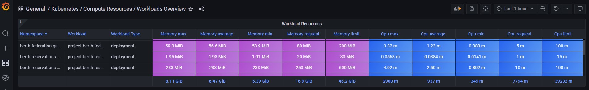

# kube-resource-checker
Collect Kubernetes workload resource metrics from Prometheus and  analyze it. 

# Usage
python3 kube_resource_checker.py

# Grafana dashboard for Kubernetes resources overview
Kubernetes resource overview for Grafana located in 'grafana_dashboard/Kubernetes _ Compute Resources _ Workloads Overview.json'

This is easy way to check used resources vs requests on whole Kubernetes cluster. It helps set proper values for deployment requests and limits.

